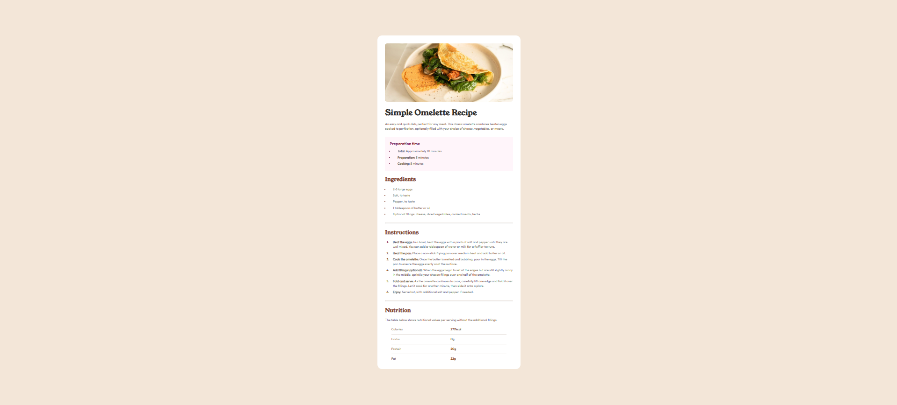

# Frontend Mentor - QR code component solution

This is a solution to the [Social Links Profile card challenge on Frontend Mentor](https://www.frontendmentor.io/solutions/responsive-recipe-page-using-css-flexbox-and-grid-nJzuNBNXN2). Frontend Mentor challenges help you improve your coding skills by building realistic projects.

## Table of contents

- [Overview](#overview)
  - [Screenshot](#screenshot)
  - [Links](#links)
- [My process](#my-process)
  - [Built with](#built-with)
  - [What I learned](#what-i-learned)
  - [Continued development](#continued-development)
  - [Useful resources](#useful-resources)
- [Author](#author)

## Overview

### Screenshot



### Links

- Live Site URL: [Live Preview](https://rishabhsikka3.github.io/recipe-page/)
- Solution URL: [Frontend Mentor Solution](https://www.frontendmentor.io/solutions/responsive-recipe-page-using-css-flexbox-and-grid-nJzuNBNXN2)

## Installation & Setup

To run this project locally:

1. **Clone the repository**

```bash
git clone https://github.com/yourusername/recipe-page.git
cd recipe-page
npm install
npm start
```

### Built with

- Semantic HTML5 markup
- CSS custom properties
- Flexbox
- CSS Grid
- Mobile-first workflow
- [React](https://reactjs.org/)

### What I learned

This project helped me practice layout centering using Flexbox instead of absolute positioning. I also learned:

- Use semantic HTML inside React components
- Respect HTML5 content model rules (e.g., avoid placing `<hr>` inside `<ul>`)
- Use modern CSS techniques to create responsive, accessible UIs
- Replace visually separating elements like `<hr>` with CSS-driven borders on `<li>` items

```jsx
<ul>
  {nutrition.map((item, index) => (
    <li
      key={index}
      style={{
        borderBottom:
          index < nutrition.length - 1 ? "1px solid var(--stone-150)" : "none",
      }}
    >
      <span>{item.label}</span>
      <span className="values">{item.value}</span>
    </li>
  ))}
</ul>
```

### Continued development

In future projects, I want to:

- Further explore accessibility and semantic HTML best practices
- Explore container queries for layout control.
- Improve accessibility by ensuring keyboard navigation and screen reader compatibility.
- Experiment with CSS Modules or Tailwind CSS for better class management

### Useful resources

- [MDN Web Docs - @font-face](https://developer.mozilla.org/en-US/docs/Web/CSS/@font-face)
- [MDN Web Docs - Flexbox](https://developer.mozilla.org/en-US/docs/Web/CSS/CSS_flexible_box_layout/Basic_Concepts_of_Flexbox)
- [Frontend Mentor - Community Solutions](https://www.frontendmentor.io/solutions)

## Author

- Name – Rishabh Sikka
- Frontend Mentor – [@RishabhSikka3](https://www.frontendmentor.io/profile/RishabhSikka3)
